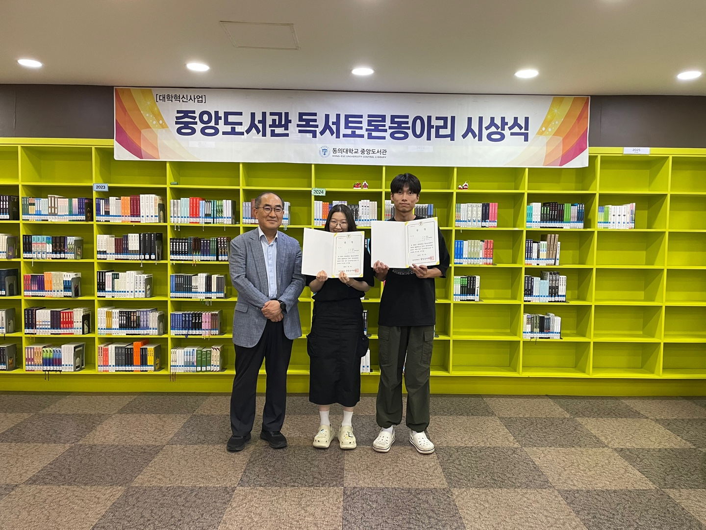

# 📖 독서토론동아리 수상 (우수상)

**🏫 주최:** 동의대학교 중앙도서관  
**📅 일시:** 2025년 7월 9일  
**🎓 수상명:** 2025학년도 1학기 독서토론동아리 우수상  
**👤 조명:** Monday  
**👨‍🎓 수상자:** 임진호 (컴퓨터소프트웨어공학과)

---

## 🏆 상장

---

## 📸 수상 현장 사진

<table>
  <tr>
    <td></td>
    <td></td>
  </tr>
</table>

---

## 📝 제출 보고서

📄 [최종 활동 보고서 보기](./독서토론%20최종보고서(Monday).pdf)

보고서에는 다음 도서에 대한 토론이 포함되어 있습니다:
- **데미안** - 헤르만 헤세
- **모순** - 양귀자

---

