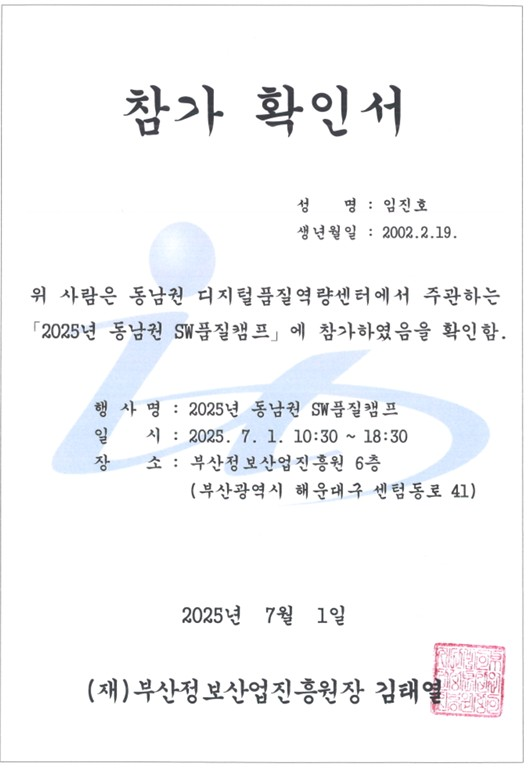

# 🛠️ 2025 동남권 SW 품질캠프 참여

---

## 🎯 활동 개요

- **행사명**: 2025 동남권 SW품질캠프  
- **일시**: 2025년 7월 1일 (10:30 ~ 18:30)  
- **장소**: 부산정보산업진흥원 6층  
- **주최**: 동남권 디지털품질역량센터  

---

## 📚 참여 목적

2025년 1학기 **소프트웨어공학 설계** 과목을 통해 배우게 된  
테스트 설계, 단위 테스트, 통합 테스트 등의 개념을  
실제 산업 현장의 테스트 품질관리 실무와 연결지어보고자  
SW 품질캠프에 참여하였습니다.

---

## 📸 현장 사진

### 🔹 참가
<table>
  <tr>
    <td></td>
    <td></td>
  </tr>
</table>

---

