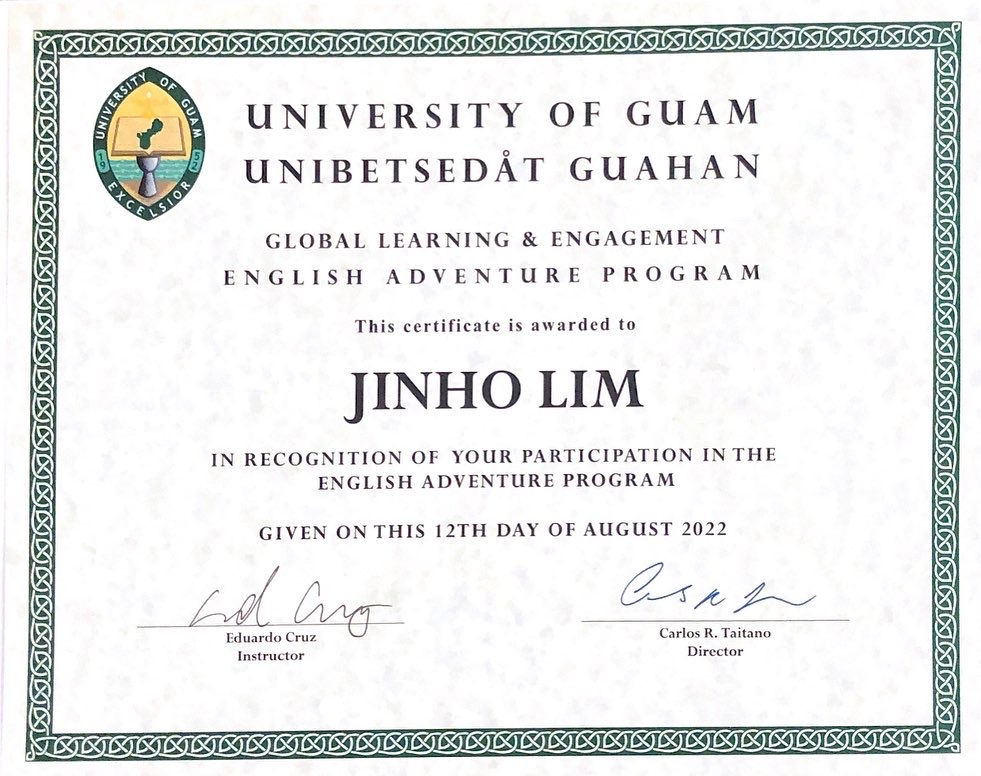
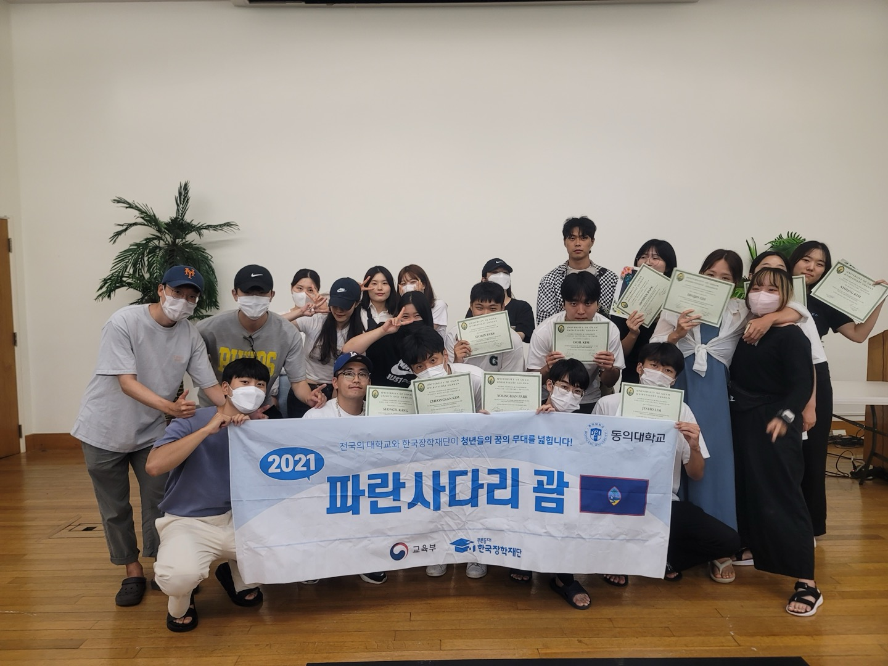
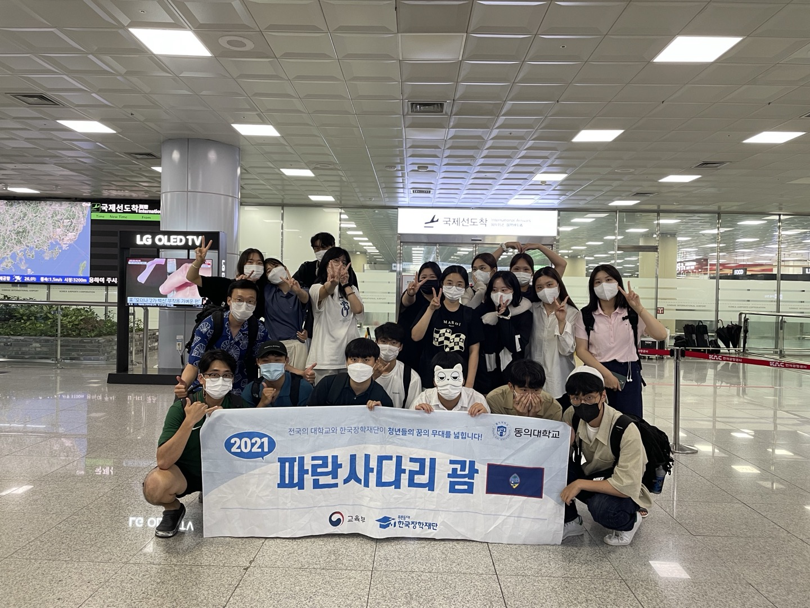
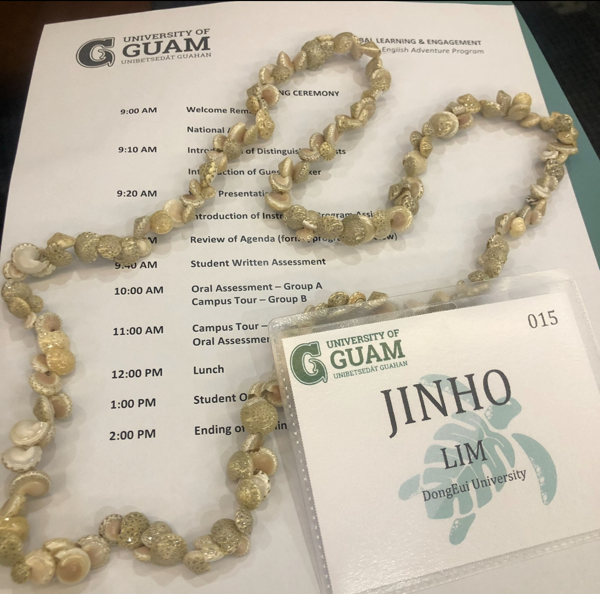

# 🌏 파란사다리 괌 글로벌연수

> 한국장학재단 주관 글로벌 역량 강화 프로그램 수료

- **프로그램명**: 파란사다리 괌 글로벌연수
- **주관**: 한국장학재단, 동의대학교
- **연수기관**: University of Guam
- **기간**: 2022년 7월 ~ 8월
- **참여자**: 임진호

---

## 📄 수료증

---

## 📸 활동 사진

| 단체샷 | 수업 사진 | 명찰 |
|--------|------------|-------|
|  |  |  |

---

## 📁 프로그램 정보

- 파란사다리 사업은 한국장학재단이 주관하는 청년 글로벌 연수 프로그램입니다.
- 본 연수는 괌 University of Guam에서 진행되었으며, 영어 커뮤니케이션 및 현지 문화 체험 중심으로 운영되었습니다.

---

## 🔗 관련 링크

- [파란사다리 소개 (한국장학재단)](https://www.kosaf.go.kr/ko/scholar.do?pg=SCHM_000173)
- [University of Guam](https://www.uog.edu/)
